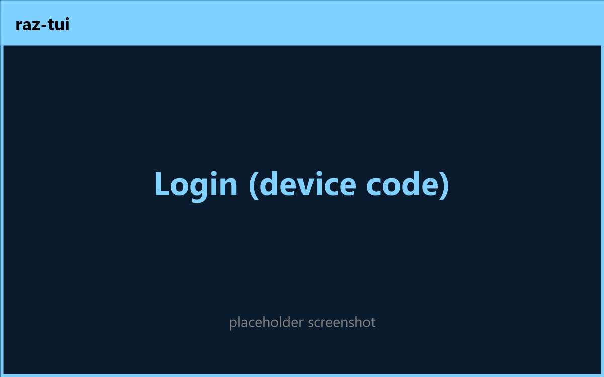
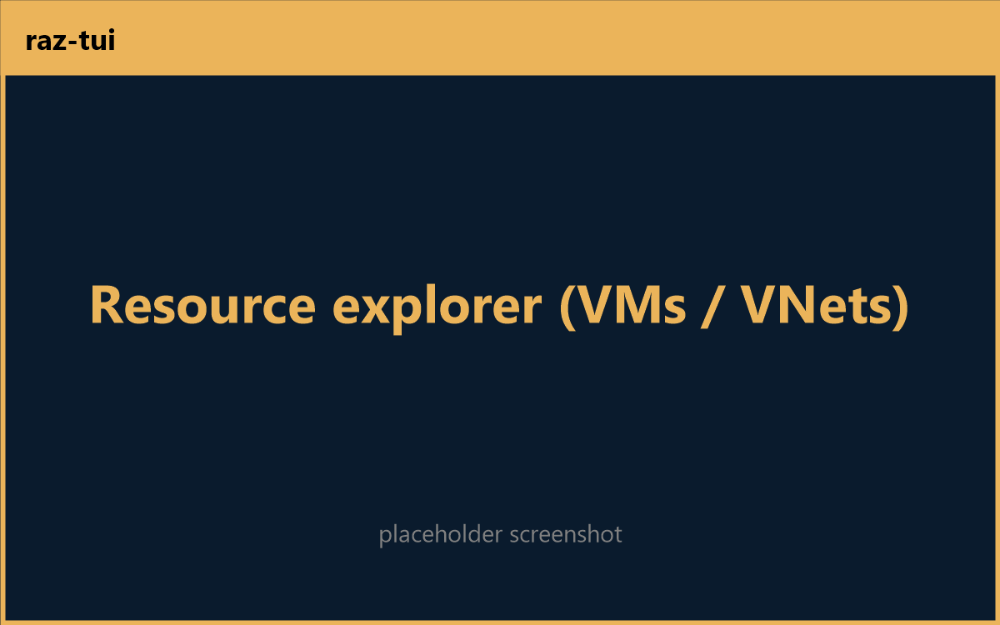

# 🦍 raz — a Rust port of a slice of the Azure CLI

> **Blazing fast Azure CLI, written in Rust.**

`raz` reimplements a slice of the Azure CLI (`az`) in Rust, invoked as `raz`. It mirrors az's
command-module design and ships **two front-ends over one core library**:

- **`raz`** — a minimal CLI (`raz login`, `raz logout`, `raz account …`, `raz vnet …`, `raz vm …`).
- **`raz-tui`** — an interactive [ratatui](https://ratatui.rs) + [tachyonfx](https://github.com/ratatui/tachyonfx)
  dashboard that browses subscriptions, VMs, and VNets with animated view transitions.

## Screenshots (raz-tui)

<!--
  Placeholders — uncomment once the captures are added to docs/screenshots/.

  | Login (device code) | Subscriptions | Resource explorer |
  |---|---|---|
  |  |  |  |
-->

## Workspace

```
crates/
  raz-core/   # engine: context, config, auth (device-code), ARM client, output
  raz/        # minimal CLI front-end (clap)
  raz-tui/    # ratatui + tachyonfx dashboard front-end
```

`raz-core` modules map onto how az structures a command module:

| az | raz-core |
|---|---|
| command table (`commands.py`) | clap subcommand tree + `command::Command` trait |
| `load_arguments` / `_params.py` | clap `#[derive(Args/Subcommand)]` |
| `custom.py` | `arm::vm` / `arm::vnet` / `auth` + front-end command fns |
| `_format.py` table transformers | `output::{render, TableSpec}` |
| global `--subscription/--output/--query` | `context::GlobalArgs` |
| `~/.azure` profile | `config::Profile` (`~/.raz/profile.json`) |

## Scope (this skeleton)

- **Live:** `login` (OAuth device-code flow against Entra, with az-style cross-tenant
  subscription discovery), `logout`, `account` (list/show/set/list-tenants), and `vnet`/`vm`
  `list` + `show` (real ARM REST GETs).
- **Stubbed with explanatory errors:** `vnet`/`vm` `create`/`delete` and `vm` `start`/`stop`
  (these are ARM mutations / long-running operations).
- HTTP uses `reqwest`. A production port would back `arm::client` and the token credential
  with `azure_core` (`Pipeline` + `BearerTokenPolicy`) and `azure_identity`; the
  `auth::credential::TokenSource` and `arm::client` seams are shaped for that swap.

## Build & test

The repository root *is* the Cargo workspace:

```bash
cargo build --release
cargo test
cargo clippy --all-targets
```

## Run

```bash
raz login                          # device-code prompt; discovers tenants + subscriptions
raz account list -o table          # all subscriptions across tenants
raz account set -s <id|name>       # set the active subscription (persisted to ~/.raz)
raz account list-tenants           # distinct tenants

raz vm list -o table               # VMs in the active subscription
raz vnet list -o table             # virtual networks
raz vm show -g <rg> -n <name>      # single VM as JSON
raz -s <id|name> vm list           # override subscription for one command
raz --query "0.name" vm list       # minimal dotted-path projection
raz logout                         # clears ~/.raz

raz-tui                            # interactive dashboard (q/Esc to quit)
```

Exit codes follow az: `0` success, `1` generic/auth error, `2` usage, `3` resource not found.

## Versioning & branching

GitFlow with git-driven semantic versioning via the reusable
[`KarlesP/cadence`](https://github.com/KarlesP/cadence) workflow. The root `VERSION` file is
the source of truth; `main`/`release/*`/`hotfix/*` produce tags + GitHub Releases.
See `.github/workflows/`.

## Releases

Two manual (`workflow_dispatch`) workflows build the binaries for Linux and Windows:

- **Build (debug)** — debug binaries uploaded as artifacts.
- **Build (release)** — optimized binaries uploaded as artifacts and attached to a GitHub
  Release tagged from `VERSION`.

## FAQ

**Why use raz instead of az?**
`az` is a large Python application — a cold start pays for the interpreter, dozens of imports,
and a sprawling extension system before it does anything. `raz` is a single native binary: it
starts in milliseconds, has no runtime to install, and ships as one file you can drop on a box
or into a container scratch image. For the commands it covers, it does the same ARM/Entra calls
with a fraction of the overhead.

**Is raz a drop-in replacement for az?**
No. `raz` intentionally implements a *slice* of `az` (login/logout, account, and vnet/vm
list/show) to demonstrate the architecture. Mutating operations are stubbed. Use `az` for full
coverage; use `raz` where startup time, footprint, or a single-binary deployment matters.

**How does login work without an app registration?**
`raz login` uses the OAuth 2.0 device-code flow against Microsoft Entra with the well-known
public Azure CLI client id — the same approach `az` uses — then discovers subscriptions across
every tenant your identity can reach via silent refresh-token exchange.

**Does it talk to real Azure?**
Yes. `login`, `account`, and `vnet`/`vm` `list`/`show` make live ARM REST calls. Tokens and the
active subscription are cached under `~/.raz`.

**Why is it "blazing fast"?**
Native compiled Rust, no interpreter startup, minimal dependencies, and direct `reqwest` calls
to ARM rather than a layered SDK + plugin system.

## Credits

Created and maintained by [**KarlesP**](https://github.com/KarlesP).
